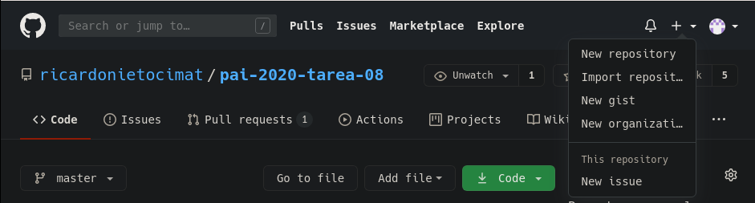
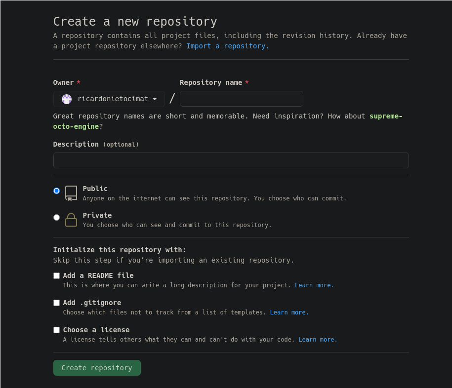
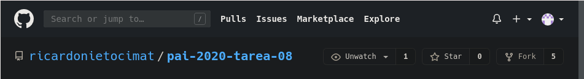
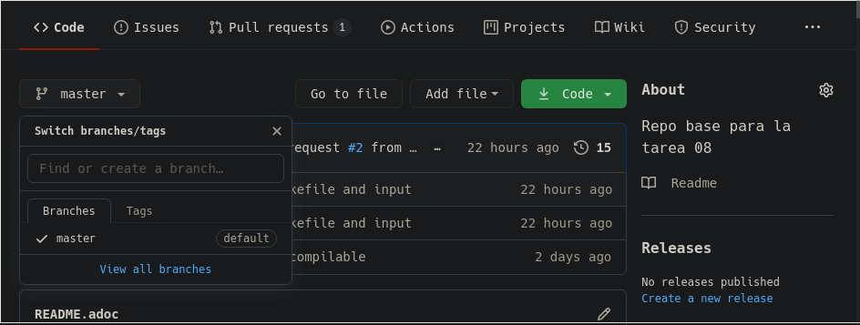
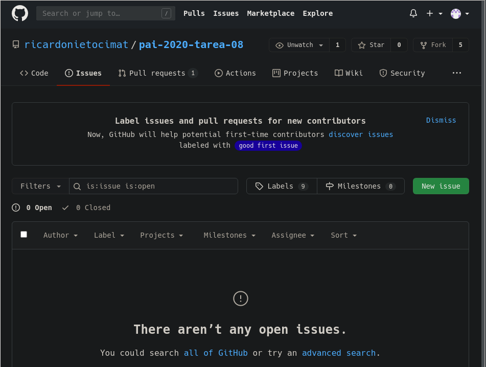
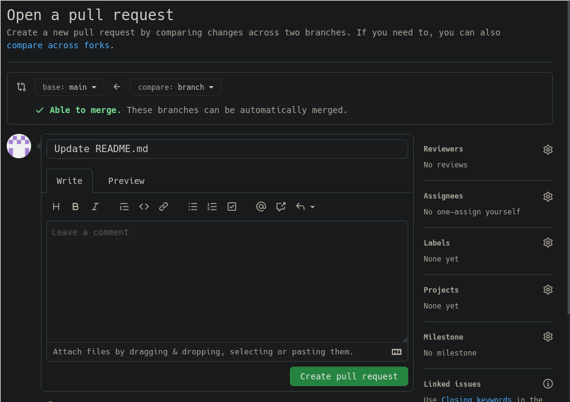

= Tutorial GIT / GITHUB 
:toc:

En este pequeño tutorial se van a realizar las operaciones básicas que se 
esperan en la tarea. La intención es que conozcan `git` y la 
plataforma `github` para los que nunca los han utilizado y como referencia
para los comandos.

== GIT 

Git es un sistema de control de versión diseñado para manejar principalmente
proyectos de desarrollo de software. 

Pueden imaginar que tienen una lista ligada, donde cada nodo tiene los cambios
que han realizado a sus archivos. De esta forma si queremos regresar a una 
"versión" de nuestro proyecto basta con deshacer (o repetir) los pasos hasta 
una versión en especifico. 

.Implementación ingenua de versión de control
[source,txt]
----

repositorio
|- a.txt 
|_ b.txt 

git 
|
v
* [ version:       v01
|   mensaje:       "crear archivo txt"
|   instrucciones: [crear a.txt, crear b.txt] ] 
|
v
* [ version:       v02
|   mensaje:       "crear main"
|   instrucciones: [
|     escribir en línea 1 de archivo a.txt "#include<stdio.h>", 
|     escribir en linea 2 de archivo a.txt "#include<stdlib.h>",
|     ...,
|     escribir en línea 1 de archivo b.txt , "1",
|     ....,] ]
|
v
* [ version:  v03
    mensaje:  "agregar documentación"
    instrucciones: [
      crear archivo doc.adoc,
      escribir en línea 1 ...] ]
----

La idea es, que podemos tener copias eficientes de los archivos (no es
necesario copiar todo los archivos solo las "instrucciones").  Y al colaborar
con otras personas nos permite sincronizar los archivos pues es suficiente con
"pedir" la "lista ligada" de nuestro compañero , ver las diferencias con
nuestra copia y agregar los nodos necesarios de su "lista ligada" a la nuestra
para que los dos tengamos la última versión. 

=== Instalar GIT 

Si tienen una distribución `linux` es usual que tengan instalado git, para 
probar, en su terminal pueden probar llamar al programa. 

.input 
[source,sh]
----
git --version
----

.output
[source,txt]
----
git version x.xx.x
----

Si les indica que no existe el programa deberán instalarlo con su administrador
de paquetes. 

* Debian/Ubuntu/... : `sudo apt install git`
* Arch/Manjaro/...  : `sudo pacman -Syu git`

=== Iniciar un repositorio git

Para realizar el seguimiento de los archivos de su proyecto es necesario 
inicializar el sistema git. 

.input 
[source,sh]
----
cd ruta/al/directorio-del-proyecto
git init 
----
.output
[source,txt]
----
Initialized emtpy Git repository ... 
----

=== Iniciar el seguimiento de un archivo 

Para que git pueda seguir los cambios de un archivo, debemos indicarle que
debe seguirlo `add` y guardar los cambios `commit`. 

.input 
[source,sh]
----
touch un-archivo.txt 
git add un-archivo.txt
git commit --message="crear un archivo de prueba"
----
.output
[source,txt]
----
[master (root-commit) e9dd839] un-archivo de prueba
 1 file changed, 0 insertions(+), 0 deletions(-)
 create mode 100644 un-archivo.txt
----

=== Guardar los cambios realizados

Supongamos que modificamos el archivo de la siguiente forma: 

.un-archivo.txt
[source,txt]
----
Se agregaron dos líneas en este archivo
la segunda línea
----

Una vez modificado  el archivo  debemos registrar los cambios `add` y 
guardarlos `commit`. 

.input 
[source,sh]
----
git add un-archivo.txt
git commit --message="agregar las dos líneas requeridas"
----
.output
[source,txt]
----
[master 39e39f6] se agregaron las dos líneas requeridas
 1 file changed, 2 insertions(+)
----

=== Ver el estado del seguimiento del proyecto 

Supongamos que hemos trabajado un poco en nuestro proyecto, 
creamos un nuevo archivo `b.txt` y agregamos una tercera línea en el 
archivo `un-archivo.txt` además de renombrarlo a `a.txt`. 

.b.txt
[source,txt]
----
este es el archivo b
----
.a.txt
[source,txt]
----
Se agregaron dos líneas en este archivo
la segunda línea
la tercera línea
----

Podemos entonces ver el estado del proyecto con el comando `status`. 

.input 
[source,sh]
----
git status
----
.output
[source,txt]
----
On branch master
Changes not staged for commit:
  (use "git add/rm <file>..." to update what will be committed)
  (use "git restore <file>..." to discard changes in working directory)
	deleted:    un-archivo.txt

Untracked files:
  (use "git add <file>..." to include in what will be committed)
	a.txt
	b.txt

no changes added to commit (use "git add" and/or "git commit -a")
----

Este mensaje nos indica que de los archivos que seguíamos se borró
`un-archivo.txt` y hay dos 
nuevos archivos que no estamos siguiendo. Si los agregamos
y vemos el estado

.input 
[source,sh]
----
git add a.txt b.txt un-archivo.txt 
----
.output
[source,txt]
----
On branch master
Changes to be committed:
  (use "git restore --staged <file>..." to unstage)
	renamed:    un-archivo.txt -> a.txt
	new file:   b.txt
----

Podemos ver que `git` detectó que el archivo fue renombrado, si estamos 
conformes podemos guardar `commit` estos cambios. 

.input 
[source,sh]
----
git commit --message="agregar el segundo archivo requerido" 
----
.output
[source,txt]
----
[master 11710ec] agregar el segundo archivo requerido
 2 files changed, 2 insertions(+)
 rename un-archivo.txt => a.txt (76%)
 create mode 100644 b.txt
----

=== Trabajar en una rama

Muchas veces cuando estamos trabajando en una nueva función o característica de
nuestro proyecto, puede ser conveniente o indispensable aislar nuestro trabajo.
Sea para nosotros mismos, o cuando colaboramos con otras personas para que los
demás no se vean afectadas con los cambios intermedios de nuestro
implementación.

Para ello podemos realizar una ramificación con el comando `branch`, esto es,
le indicamos al sistema de control de versiones que queremos crear un registro
de versiones independiente. Puede visualizarse como crear una segunda "lista
ligada" en la cuál guardamos todos los cambios y en cualquier momento podemos
cambiar a la versión original sin deshacer los cambios. 

.Esquema ingenuo de una rama
----
git -> * -> * -> * -> *             (main)
            |
            * -> * -> * -> * -> *   (rama)
----

De esta forma todo lo que trabajamos en la rama "rama" no afecta a las
versiones del proyecto principal (común mente llamado main o master) y podemos
movernos fácilmente entre las ramas (main y rama) alternando entre los dos
estados de nuestro proyecto. 

Para crear una rama en nuestro proyecto empleamos el comando `branch` 
.input
[source,sh]
----
git branch rama
----

y para movernos entre las ramas el comando `checkout`. 

.input
[source,sh]
----
git checkout rama 
----
.output
[source,txt]
----
switched to branch 'rama'
----

Con el comando `branch` sin argumentos podemos ver las ramas que hemos 
declarado y la activa esta indicada con un `*` .

.input
[source,sh]
----
git branch
----
.output 
----
  master
* rama
----

En nuestro proyecto tenemos dos ramas (master) y (rama), actualmente nos 
encontramos en la rama 'rama'. 
Al trabajar en esta rama las modificaciones que guardemos se almacenan en 
la "lista ligada" de 'rama' no de 'master'. Por ejemplo creamos tres nuevos
archivos, `c.txt`, `d.txt` y `e.txt`, los guardamos y finalmente listamos 
los archivo en el directorio. 

.input
[source,sh]
----
echo "archivo c" > c.txt 
echo "archivo d" > d.txt 
echo "archivo e" > e.txt 
git add . 
git commit --message="agregar tres archivos en la rama"
git status
ls
----

.output
[source,txt]
----
a.txt
b.txt
c.txt
d.txt
e.txt
----

En el directorio contamos con los cinco archivos. Si nosotros requerimos 
restaurar rápidamente el estado del proyecto al momento en que hicimos 
la bifurcación (creamos la rama), basta con cambiarnos a la rama original 
(master). 

.input
[source,sh]
----
git checkout master
ls
----

.output
[source,txt]
----
a.txt
b.txt
----

Note que los archivos que generamos y guardamos en la rama 'rama' no están en
el directorio. De igual forma si regresamos a la rama 'rama' con `checkout`
podemos ver que los archivos vuelven a aparecer y el estado del proyecto es el
mismo que cuando guardamos con `commit` los cambios en la rama. 

.input
[source,sh]
----
git checkout rama
ls
----

.output
[source,txt]
----
a.txt
b.txt
c.txt
d.txt
e.txt
----

=== Unir una rama 

El potencial de las ramas es cuando las unimos mediante el comando `merge` ,
esto es, combinamos los cambios realizados en la rama `rama0` en la `rama1`, 
de forma que la `rama1` contiene tanto sus modificaciones como las 
de la otra rama. 

Supongamos que en nuestro proyecto requerimos una nueva función, entonces 
creamos una rama 'mifuncion', nos cambiamos a ella, trabajamos creando 
la nueva función en un archivo `fun.txt` y guardamos los cambios. 

.input 
[source,sh]
----
git checkout master 
git branch mifuncion
git checkout mifuncion
echo "def funcion_muy_importante(argumentos) argumentos[0] end" > fun.txt 
git add .
git commit --message="implementar la función importante"
ls 
----

.output
[source,txt]
----
a.txt
b.txt
fun.txt
----

Supongamos también que en paralelo estuvimos trabajando en la rama `rama` y 
nuestro archivo `d.txt` utiliza la función que estamos generando en 
la rama `mifuncion`.

.input 
[source,sh]
----
git checkout master 
git checkout  rama
echo "usar funcion_muy_importante([0,2,1])" >> d.txt 
git add . 
git commit --message="realizar una acción con la función importante"
ls 
----

.output
[source,txt]
----
a.txt
b.txt
c.txt
d.txt
e.txt
----

Notemos que en este momento la rama `mifuncion` no contiene la aplicación de la
función y la rama `rama` no contiene la definición de la función. Sin embargo
para poder continuar trabajando es necesario que una de las dos ramas tenga la
implementación completa. Para ello debemos unir los cambios de una en la otra.
Supongamos que combinamos mediante el comando `merge` los cambios realizados en
la rama `mifuncion` a  la rama `rama` (i.e `mifunción->rama`). 

Para ello nos cambiamos a la rama `rama` y utilizamos el comando merge. 

.input 
[source,sh]
----
git checkout rama 
git merge mifuncion --message="combinar mifuncion en rama"
----

.output
[source,txt]
----
Merge made by the 'recursive' strategy.
 fun.txt | 1 +
 1 file changed, 1 insertion(+)
 create mode 100644 fun.txt
----

Observe que ahora la rama `rama` contiene la definición de la función. 

.input 
[source,sh]
----
ls
----

.output
[source,txt]
----
a.txt
b.txt
c.txt
d.txt
e.txt
fun.txt
----

=== Eliminar una rama 

Finalmente una vez estamos conformes con los cambios en la rama `rama` podemos
combinarla en la rama principal `master` y eliminar  con la bandera `--delete`
las ramas que usamos de forma temporal . 

.input 
[source,sh]
----
git checkout master
git merge mifuncion --message="combinar rama en master"
git branch --delete rama 
git branch --delete mifuncion
git branch
----

.output
[source,txt]
----
* master
----

== GitHub

Como se comentó, `git` es un sistema de control de versiones que tiene como
objetivo facilitar la colaboración. Para ello varias plataformas han surgido
para facilitar el proceso. 

GitHub es una plataforma para colaborar, emplea git y agrega ciertos conceptos
que ayudan a coordinar el trabajo. Una forma sencilla de visualizar a GitHub es
como un servidor que tiene un repositorio `git`, el cuál los colaboradores
deciden utilizar como referencia para coordinar y comunicar las tareas a
realizar. 

=== Crear un repositorio en Git 
  
Para crear un repositorio en Git es suficiente con dar click en el símbolo 
`+` en la esquina superior derecha, al lado izquierdo del icono de usuario y a 
la derecha de la campana. Y seleccionar la opción `new repository`. 

completan el formulario y esto les generará su nuevo repositorio. 

=== Clonar un repositorio 

Para ello deben acceder a la url del repositorio que quieren clonar y en la
parte superior derecha hasta la derecha encontrarán un botón con el texto
`fork`. 

Al dar click, automáticamente la plataforma creara un repositorio que es una
copia exacta del original, en la que ustedes tienen acceso de escritura. 

=== Crear una rama 

Para ello en su repositorio, en la parte izquierda pueden ver un botón 
que tiene el nombre de la rama `master`, al darle click  pueden escribir 
el nombre de la nueva rama.  Esto automáticamente creará la rama. 

=== Cambiar entre ramas 

Para ello en su repositorio, en la parte izquierda pueden ver un botón 
que tiene el nombre de la rama `master`, al darle click, pueden elegir 
la rama en la que desean trabajar. 

=== Crear un hilo de discusión 

Para coordinar el trabajo, la plataforma git permite crear hilos de discusión, 
para ello en la parte superior hay un menú con el texto `issues`. Al 
darle click les desplegará todos los hilos y les permitirá generar uno.

=== Trabajar en una copia local 

Aunque es posible crear archivos en la plataforma GitHub, lo usual es 
descargar a la computadora el repositorio y trabajar de forma local, para ello
en la zona superior a los archivos hay un botón verde que tiene el texto 
`Code`. Allí pueden copiar el enlace `HTTPS`. 

image::./javier.g-ricardo.n/imgs/code.png[width=500]

En su terminal emplean el comando `clone` para descargar el repositorio. 

.input 
[source,sh]
----
git clone https://github.com/ricardonietocimat/pai-2020-tarea-08.git repo
cd repo 
git status
----

Una vez en su máquina se trabaja con la utilidad `git`. 

=== Sincronizar repositorio

Para colaborar es necesario mantener sincronizada la copia local 
con el repositorio en GitHub, para ello los comandos `pull`  nos permite 
descargar los cambios en el servidor. 

.input 
[source,sh]
----
git pull
----

y `push` nos permite enviar nuestros cambios al servidor. 

.input 
[source,sh]
----
git push
----

En la terminal se les pedirá su nombre de usuario y contraseña de GitHub. 

=== Solicitud sincronización de cambios

El último paso para la colaboración es, una vez contamos con las modificaciones
al repositorio original en nuestra copia (GitHub) podemos solicitar a los
desarrolladores del repositorio original que pidan y combinen nuestros cambios
en su repositorio.

Para esto, una vez se actualicen los archivos en el repositorio, les deberá
aparecer en la parte superior de los archivos una opción de `pull request`. O
en su defecto en el menú de GitHub en la sección de Pull Request pueden
crearla. 

image::./javier.g-ricardo.n/imgs/pull-request.png[width=500]

Y pueden elegir de que rama a que rama o de que repositorio a que repositorio
realizar la solicitud. 

== Notas Finales

`git` permite mantener versiones de los archivos, y esta enfocado en una 
colaboración sencilla y descentralizada. 

`GitHub` es un plataforma que facilita la coordinación del trabajo, empleando 
git. 

Con esta mini guia puede darse una idea del funcionamiento de estas
aplicaciones. 

A forma de ejercicio se pide que sigan los pasos y manden una
solicitud de sincronización de cambios para corregir o aclarar partes del
documento. 

